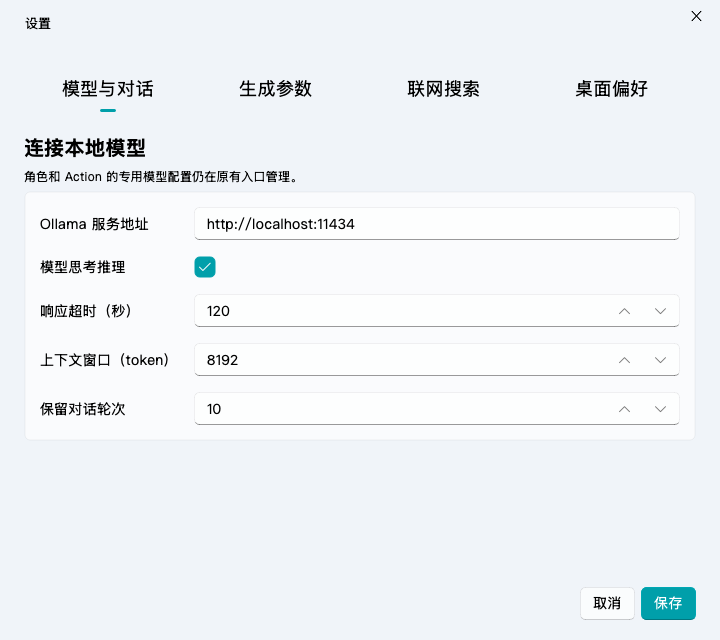
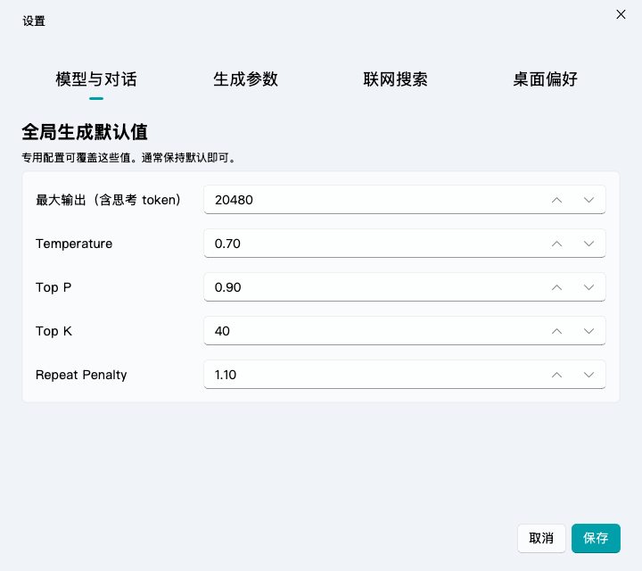
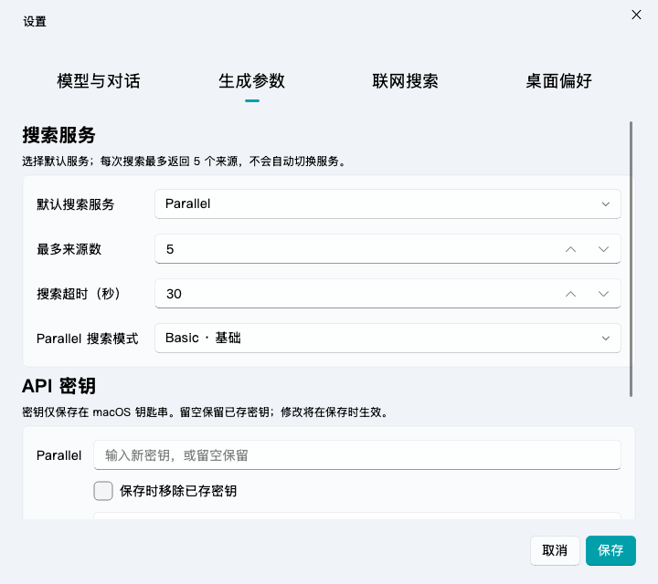
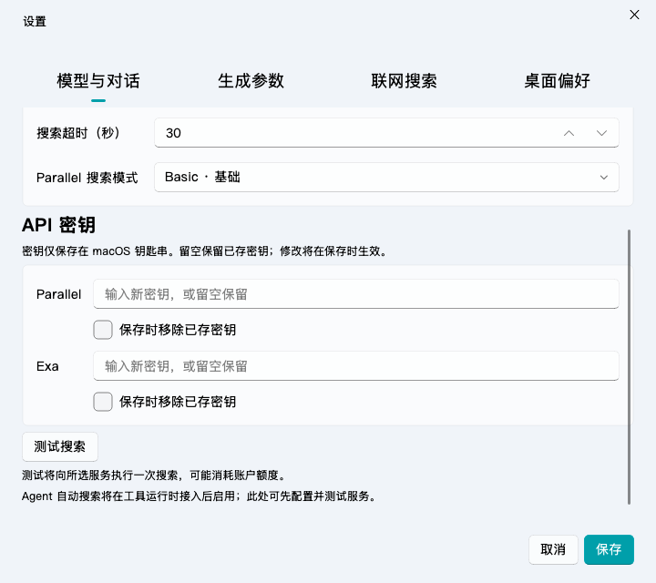
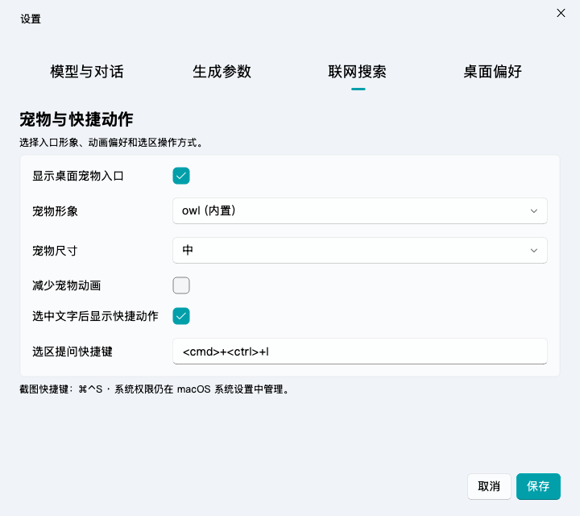

# Harness 协议基础与搜索设置 · 2026-10-04

本次是 H1 的第一批协议改造，并提前完成 H3 的供应商适配与设置入口。**完整 Agent 工具循环仍在开发中**，当前普通聊天与 Action 均不执行 Bash 或自动搜索。设置中的「测试搜索」可独立验证真实服务。

## 已实现

- Qt 与 requests 使用同一个 Ollama 消息汇集器，保留内容、思考、完整工具调用、供应商可选 ID 和结束指标。相同参数的两个调用保持独立；不猜测或合并未验证的字符串参数片段。
- 请求新增不可变 run / step / request / conversation 身份和 chat / action 来源。事件有递增序号，界面拒绝其他步骤及重复片段；Action 重新生成保留来源。
- `done_reason=length` 成为 `limited`，保留部分回复，停止当前请求，不自动续写或执行截断工具调用，不激活为成功答案。schema 4 暂以失败版本保存部分答案，同时在配置快照记录 `run_status=limited`；正式运行表在 H4 完成。未知结束原因和畸形调用作为协议错误。
- 未授权的工具调用不会被当作成功回答，也不会触发任何执行器。
- Parallel / Exa 都适配为统一的来源记录，包含 ID、标题、真实 HTTP(S) 链接、摘录和日期。重复和含凭据、控制字符或非 HTTP(S) 的链接过滤；来源数量现可在设置中选择 1–99，默认 5。实际数量取决于供应商返回和上下文预算，见 [工具次数与搜索来源设置](工具次数与搜索来源设置-2026-10-05.md)。
- 搜索 HTTP 请求在 Qt 事件循环异步执行，可停止，设置总超时及 2 MiB 接收上限。取消后不继续发送；重定向不跟随；错误不展示服务器原始正文或请求密钥。不自动重试或切换供应商。

## 设置的信息结构

使用 Fluent 默认 Pivot、卡片、标签、输入框、下拉框、数值框和按钮；没有增加自绘控件或新组件 QSS。窗口可调整大小，各页独立滚动，保存/取消固定在底部。

| 分页 | 设置内容 |
|---|---|
| 模型与对话 | Ollama 地址、现有思考开关、超时、上下文窗口、保留轮次 |
| 生成参数 | 输出 token 上限、温度、Top P、Top K、重复惩罚 |
| 联网搜索 | 默认供应商、最多来源数、搜索超时、Parallel 模式、两家 API 密钥、测试/停止 |
| 桌面偏好 | 宠物形象、显示入口、尺寸、减少动画、快捷动作、选区快捷键 |

新增配置仅包含 `search_provider`、`search_max_results`、`search_timeout`、`search_parallel_mode`。凭据不进入 SettingsManager、SQLite 或 `settings_applied` 信号。

修复旧设置页加载时把 temperature / top_p / top_k 的合法零值替换成默认值的问题。全局默认值与 config 对齐；模型 profile 的覆盖入口保持原位。动态思考档位尚未迁移，现有全局开关仍是布尔值。

## 供应商请求契约

2026-10-04 重新核对官方接口，旧调研中的 Parallel 模式描述应以本表为准。

| 服务 | 请求 | 摘要字段 |
|---|---|---|
| [Parallel Search](https://docs.parallel.ai/api-reference/search/search) | `POST https://api.parallel.ai/v1/search`；`x-api-key`；`search_queries=[query]`、可选 objective、mode、`max_chars_total=6000` | results 中 title/url/publish_date/excerpts |
| [Exa Search](https://exa.ai/docs/reference/search) | `POST https://api.exa.ai/search`；`x-api-key`；query、可选 objective、`type=auto`、`numResults≤5`、`contents.highlights=true` | results 中 title/url/publishedDate/highlights |

Parallel 当前模式为 turbo / fast / basic / advanced，默认显式采用 basic。正式接口未提供这里需要的 `max_results` 请求字段，因此应用在返回后裁剪来源数量；来源上限并不等于服务计费上限。Exa 不开启深度研究、全文抓取或输出 schema。供应商 session 不跨搜索/会话复用。

搜索测试固定查询 Python 官方文档，不发送聊天内容、选区或本地文件。点击时会实际请求所选服务，可能消耗服务账户额度。当前自动化只使用模拟服务器，尚未用真实密钥调用两家付费 API。

## 密钥与操作

密钥通过 PyObjC Security 的通用密码接口存入 macOS 登录钥匙串，service 为 `com.milin.ai-desktop-assistant.web-search`，account 分别为 parallel / exa。不使用命令行参数、明文文件或开发环境变量作为回退。

1. 打开设置 → 联网搜索，选择默认服务。
2. 在对应服务输入新密钥，可先点击「测试搜索」。测试可使用尚未保存的新密钥。
3. 点击「保存」将密钥写入钥匙串，将非敏感配置写入现有设置表。留空保留旧密钥；勾选「保存时移除已存密钥」才删除。
4. 钥匙串失败时显示内联错误并保持设置打开。两家密钥独立写入，不是跨钥匙串/SQLite 的原子事务；若后一个写入失败，前一个已完成的操作会保留，已处理输入清空，未处理输入仍可重试。

取消设置不修改密钥。关闭设置会取消仍在执行的测试并清空输入。`--search-runtime` 只验证冻结包能加载原生桥接，不读取或修改任何钥匙串条目，也不是网络连通性或账户验证。

## 预览

默认 720×640，最小 640×540。搜索页可滚动，以下为源码真实 Qt 控件的离屏预览；不是原生 Retina 桌面验收。

## 验证与下一步

最终验证：全量 **721 passed**，两条既有测试收集警告；Ruff、差异检查和本轮文档本地链接检查通过。覆盖来源映射、输入/响应错误、凭据增删与隔离、取消/预取消、密钥不进入信号/数据库、零值保留、完整/多次/同参数工具调用、错误供应商 ID、字节分片、输出上限、同 request 不同步骤、重复事件和 Action 重试来源。

`dist/AI桌面助手.app`（1.5.0，约 866MB）已重建，沿用 `AI Desktop Assistant` 稳定证书；严格签名和发布预检、原生聊天/设置初始化、Apple Vision OCR、英文语音、schema 4 启动与 schema 0 升级/备份冒烟通过。新增包内 `--search-runtime` 检查确认 Security 四个钥匙串函数可加载，未读取真实密钥；13 个相关包内模块字节码与最终源码一致。重开该新版应用可体验分组设置；完整 Agent 工具循环尚不可用。本轮没有 commit / push。

下一批 H1：实现唯一 RunLoop / RunWorker，先接普通聊天和 Action 的单轮、空工具路径；完成 think 的继承 / 模型默认 / 精确档位迁移、完整协议块预算、取消和步骤状态的对照测试。之后 H2 才接 Bash 解析/确认/停止，H3 将本次搜索适配器接入工具循环与来源渲染，再做 H4 运行存储和 H5 Fluent 工具卡片。正式开启工具授权前保持原有聊天功能。
