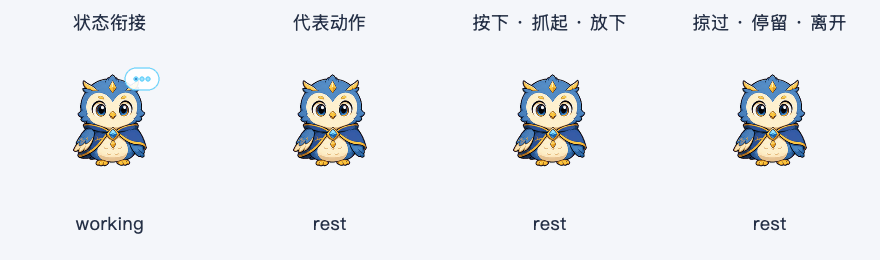
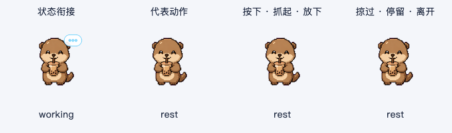
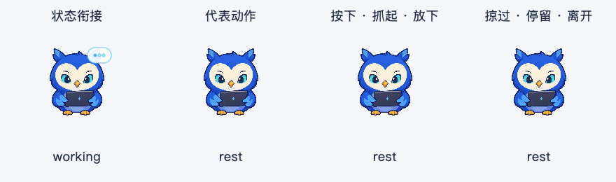
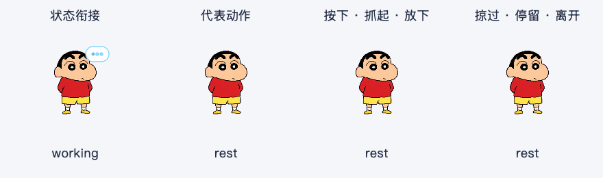

# 宠物动作节奏与悬停打磨 · 2026-10-08

本轮在上一轮连续补帧基础上，打磨四形象的输入回应、动作连续性和播放节奏。继续使用现有图集与局部补帧，耳尾跟随属于下一轮的部件素材工作。

## 体验变化

- 鼠标停留 140 ms 后才触发回应。快速掠过宠物不改变姿势；工具条继续保留 350 ms 的独立出现延迟。
- 鼠标进入、离开或再次进入时，正在播放的眨眼、展翼、举爪继续完成；离开后收回到闲置姿势。有效回应之间保留 1.2 秒间隔。
- 按住、拖动、松开的反馈优先于悬停。尚未触发的悬停回应在按下、任务开始、隐藏、切换紧凑模式、重载素材或开启减少动态效果时取消。
- 新任务仍能打断动作；任务状态立即变化，保留上一轮的短桥接与定格策略。
- 招呼优先选取与当前姿势兼容的动作，并从相同姿势开始。内置猫头鹰的方向凝视增加现有注意姿势的眼部引导，避免已抬眼时突然切回初始表情。
- 重复闲置与招呼动作每次播放选择一个 ±8% 范围内的速度系数，整段动作保持相同系数。任务过渡、按住、拖动定格和结果回应保持固定节奏。
- 直接触发代表动作与闲置、悬停调度共用原有类别冷却，避免短时间内重复展翼或举爪。

## 启停与收尾

| 动作 | 调整 | 标称时长 |
| --- | --- | --- |
| Astra 展翼 | 留出侧看准备，小幅缓起，中段加速，展翼停留，收翼逐步减速 | 1,080 ms |
| Boba 举爪 | 起手稍慢，中段加速，举爪短停，放下逐步减速 | 935 ms |
| Astra、小新放下回应 | 延长回到安静姿势后的收尾，避免动作尾部过急 | 420 ms |
| Boba 放下回应 | 逐步放爪，安静停留，再轻眨眼收尾 | 540 ms |

代表动作每次实际时长受小幅速度变化影响。身体与道具仍使用原帧，像素角色继续使用清晰采样。

## 计时修复

频繁鼠标进出或工具状态更新会重新安排单次计时器。原来的安排方式可能把剩余一帧重新延长为完整一帧。本轮按真实经过时间计算原定截止点，避免动作被反复延长。

修改语义状态之前先推进已有动画时间，因此搜索、执行等连续事件不会抹掉已过去的过渡时间。静止悬停或系统休眠期间，冷却仍按实际经过时间推进；视觉播放保留有限补偿，避免恢复后快速补播大量动作。

空闲仍只安排下一次动作的单次唤醒，悬停定格和等待确认在过渡结束后停止动画计时器。此次没有增加持续轮询。

## 实现与验证

- `pet_manifest.py`：schema 1 的可选 `tempo_variation`，默认 0，校验范围 0–0.15 与有限数值，旧配置兼容。
- `pet_animator.py`：播放实例速度系数、闲置/悬停动作连续性、兼容姿势起播、代表动作冷却、视觉时间与实际经过时间的区分。
- `float_button.py`：可取消的悬停停留、按住和任务优先、原定帧截止点、状态变更前推进时间。
- 四个配置文件调整节奏；所有图集、局部补帧与原 `~/.petdex` 文件保持不变。
- 新增 46 项回归，覆盖四形象跨悬停继续播放、按住姿势、速度边界与完整时长、静止期间冷却、当前姿势起播、快速掠过、任务取消停留回应、原定唤醒和连续工具事件。
- 相关回归 266 项通过。
- 完整回归 1,519 项通过，2 个原有收集警告，耗时 66.85 秒。
- [动态采样](assets/pet-animation-audit-feel-v4-2026-10-08.json)：四形象 × 四场景 × 90 帧，共 1,440 帧，检查遮罩、原素材指纹及掠过/收尾行为。
- [静态组合](assets/pet-experience-audit-feel-v4-2026-10-08.json)：四形象 × 三种尺寸 × 两种背景 × 四种状态，共 96 个组合通过。
- [原生 Cocoa](assets/pet-native-feel-v4-2026-10-08.json)：四形象工具条显示和操作保留编辑器焦点、文本选区，朗读入口正确派发。
- Ruff 与 `git diff --check` 通过。
- `dist/AI桌面助手.app` 已重建，版本 1.5.0，约 867 MB；稳定签名、release preflight 与隔离启动冒烟通过。OCR、英语朗读、搜索桥接、Bash、Fluent 任务卡、schema 5 初始化及 schema 0 升级检查通过。
- [安装包一致性](assets/pet-feel-v4-bundle-2026-10-08.json)：8 个运行模块和 7 项配置/图片资源匹配当前源码；安装包中的两组局部补帧可以实际加载。

## 复现

```sh
python3 -m pytest tests/ -q
QT_QPA_PLATFORM=offscreen python3 scripts/preview_pet_animation.py --feel --tag feel-v4-2026-10-08
QT_QPA_PLATFORM=offscreen python3 scripts/preview_pet_experience.py --tag feel-v4-2026-10-08
QT_QPA_PLATFORM=cocoa python3 scripts/preview_pet_experience.py --native-smoke --tag feel-v4-2026-10-08
./scripts/build.sh --smoke
```

动态预览使用确定性的 Qt 播放时间，以 50 ms 采样。停留回调在采样中按 150 ms 显式推进，真实 QTimer 的停留与取消另有交互测试覆盖。预览不启动模型、数据库、截图或全局快捷键。

## 动态预览

四列依次为任务衔接、代表动作、按下/拖动/松开，以及掠过/停留/离开。









## 体验方式

退出旧应用，再打开 `dist/AI桌面助手.app`。快速掠过后停留一次，动作中移出并重新进入，再按住、拖动、放下；最后在动作中开始任务。重点观察动作是否被重复起播、按住表情是否被悬停打断，以及日常节奏是否安静自然。

本轮没有重启用户正在使用的应用。
