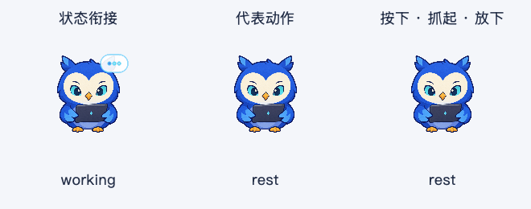
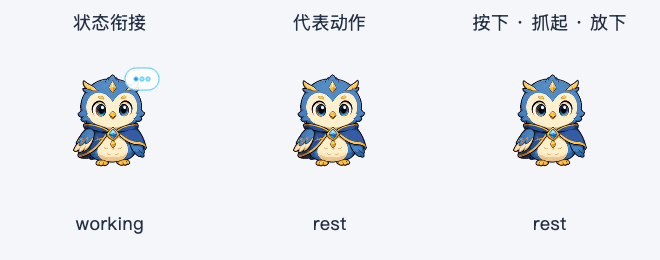
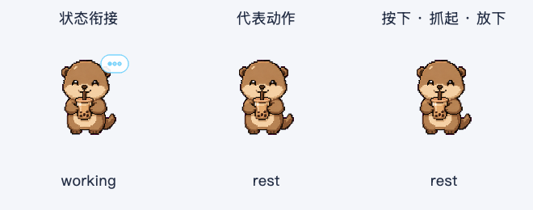
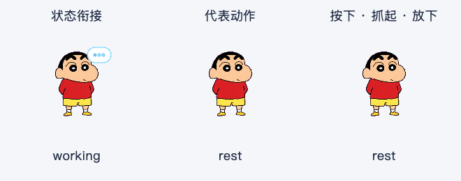

# 宠物动画表现打磨 · 2026-10-07

本轮承接四形象体验改造，按“状态过渡 → 每只一个代表动作 → 交互回应 → 扩展动作库”完成开发。四个形象继续使用现有角色；本轮把有限的可靠姿势组织成完整动作，并补齐内置猫头鹰的眼部中间帧。

## 已完成的行为

### 状态过渡

- 任务状态、确认入口和状态标识立即更新，姿势用短桥接动画衔接。
- 内置猫头鹰常规过渡约 300 ms；Astra、Boba、小新约 240–300 ms。配置校验限制桥接动画不超过 600 ms。
- 开始工作时进入凝神姿势；等待确认时恢复注意姿势；完成任务时先退出工作姿势，再播放结果回应；停止时回到安静姿势。
- 工作、搜索、执行共用专注姿势。连续工具事件保留过渡进度，避免反复重播开场。
- 过渡可以被新任务打断。若当前帧在目标桥接中，直接从该帧继续；缺少兼容帧时立即显示目标姿势。
- 结果事件保留自身的播放和回归逻辑。新的任务会清除未播放的旧结果，不积压动作。

### 四个代表动作

| 形象 | 代表动作 | 时长 | 本轮素材处理 |
| --- | --- | --- | --- |
| 内置猫头鹰 | 看屏幕、抬眼回应 | 1,250 ms | 补齐专注半闭眼；瞳孔方向和半程帧；身体、电脑、脚位置固定 |
| Astra | 侧看、展翼、收回 | 900 ms | 复用同一角色的侧看与翅膀帧；工作过渡使用收翼和凝神帧 |
| Boba | 拿着茶杯举爪招呼 | 980 ms | 复用喝茶、举爪和同一角色的思考帧，保留像素边缘 |
| 小新 | 小嘴形、闭眼、恢复 | 800 ms | 使用原有同一脸型的 48–53 行；工作时复用原有托腮姿势 |

代表动作进入闲置候选库，权重为普通动作的 0.3，同一类别冷却 45 秒。它们偶尔出现，日常仍以安静微动作为主。

### 交互回应

- 按下：立即显示短暂的眯眼或闭眼回应，保持到松开。
- 拖动：超过原有拖动阈值后切换抓起姿势，保持静止，不持续唤醒动画计时器。
- 放下：播放短回应并恢复当前姿势。拖动不会触发原有对话点击。
- 正常点击仍立即发出原有点击信号，回应动画不延迟打开对话。
- 拖动中开始任务时，任务姿势立即接管；松开不会再插入闲置回应。
- 隐藏或切换紧凑模式会清除按住、拖动姿势，避免再显示时卡住。
- 猫头鹰支持鼠标从上、下、左、右进入时的短暂凝视。Astra 有向右看的素材；其余方向和两个像素角色继续使用现有的招呼回应，不用不对应的姿势冒充方向凝视。
- 开启系统或应用的“减少动态效果”后，跳过过渡、凝视和指针动作，直接显示语义姿势。

### 节奏和动作库

- 四个形象的闲置候选动作均从 5 个扩展到 7 个。
- 调度器按动作类别去重，避免连续抽到名字不同但内容都是眨眼的动作。
- 闲置动作之间安静停留 6–12 秒，动作完成或交互结束后重新留出休息时间。
- 悬停回应结束后保持静止；等待确认的过渡结束后停止动画计时器。
- 帧时长继续按真实经过时间驱动。闭眼较快、恢复稍慢；像素角色使用原帧清晰采样。

## 实现位置

- `ai_desktop/ui/pet_manifest.py`：保持 schema 1 和旧素材兼容，新增可选 `transitions`、`interactions`，以及动画 `family`、`weight`、`cooldown_ms`。
- `ai_desktop/ui/pet_animator.py`：即时语义状态、可打断桥接、指针动作、定格、类别去重和冷却调度。
- `ai_desktop/ui/float_button.py`：连接进入方向、按下、拖动、松开和窗口生命周期；完成光点的绘制与遮罩共用坐标，修复窄轮廓角色裁剪。
- `ai_desktop/ui/pet_layers.py`、`ai_desktop/pets/owl-v2/generate_spritesheet.py`：同一眼部纹理和轮廓生成专注中间帧、方向瞳孔；猫头鹰图集由 8 帧扩展到 18 帧。
- `ai_desktop/pets/petdex-profiles/*.json`：按原图集指纹匹配的新动作与过渡映射。原始 `~/.petdex` 文件不修改。

这轮没有为像素角色补绘连续身体中间帧。更细的抬手、收翼、头部跟随和耳尾延迟，需要下一轮独立绘制匹配现有角色的素材；当前改善主要来自兼容姿势、帧时长、可打断过渡与动作节奏。

## 可重复验证

```sh
QT_QPA_PLATFORM=offscreen python3 -m ai_desktop.pets.owl-v2.generate_spritesheet
QT_QPA_PLATFORM=offscreen python3 scripts/preview_pet_animation.py
QT_QPA_PLATFORM=offscreen python3 scripts/preview_pet_experience.py --tag animation-v2-2026-10-07
QT_QPA_PLATFORM=cocoa python3 scripts/preview_pet_experience.py --native-smoke --tag animation-v2-2026-10-07
```

- 完整回归：1,445 项通过，2 个原有收集警告。
- 修复完成光点遮罩及隐藏时定格清理后，相关回归：196 项通过；追加成功、失败反馈在三种尺寸下的全绘制像素检查：4 项通过。
- 动画采样：四形象 × 三段动画 × 90 帧，共 1,080 帧，无绘制像素越出遮罩。
- 静态组合：四形象 × 三种尺寸 × 两种背景 × 四种状态，共 96 个组合通过。
- 原生 Cocoa：四形象工具条显示与操作均保留编辑器焦点和文本选区，朗读入口正确派发。
- 所有预览检查均验证原始 Petdex 文件未改动。
- Ruff 和 `git diff --check` 通过。
- `dist/AI桌面助手.app` 已重建，版本 1.5.0，约 867 MB；稳定身份签名和 release preflight 通过。
- 打包中的 8 个运行模块与当前源码一致，5 项图集/配置资源的 SHA-256 与源码一致，见 [打包一致性报告](assets/pet-animation-bundle-2026-10-07.json)。
- 打包后的 OCR、英语朗读、搜索桥接、Bash 运行时与 Fluent 任务卡隔离冒烟通过；schema 5 首次启动以及 schema 0 升级、14 项持久化设置和备份验证通过。
- 未重启用户正在使用的应用；体验新动画需要退出旧进程，再打开本次构建的应用。

## 动态预览

GIF 按真实 Qt 播放器和窗口以 50 ms 采样，三列依次为状态衔接、代表动作、按下/抓起/放下。任务标签立即变化，动画短暂衔接。预览主动停止系统计时器，使用确定性的经过时间推进，不连接模型、数据库、截图或全局快捷键。






报告：[动画采样](assets/pet-animation-audit-2026-10-07.json)、[尺寸与背景](assets/pet-experience-audit-animation-v2-2026-10-07.json)、[原生焦点](assets/pet-native-animation-v2-2026-10-07.json)。

## 体验顺序

1. 重启新打包的应用，先用当前形象观察闲置动作和短暂悬停。
2. 点击、轻移鼠标、拖动一段、松开，确认小移动仍是点击，真正拖动不会打开对话。
3. 发起一项任务，观察工作 → 搜索/执行 → 等待确认 → 继续 → 完成；快速开始下一项任务，旧结果动作应立即让位。
4. 切换另外三个形象，再试“减少动态效果”。重点观察眼睛或脸型是否连贯、任务切换是否干脆、日常动作是否打扰阅读。
