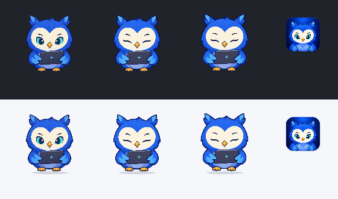
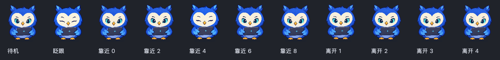
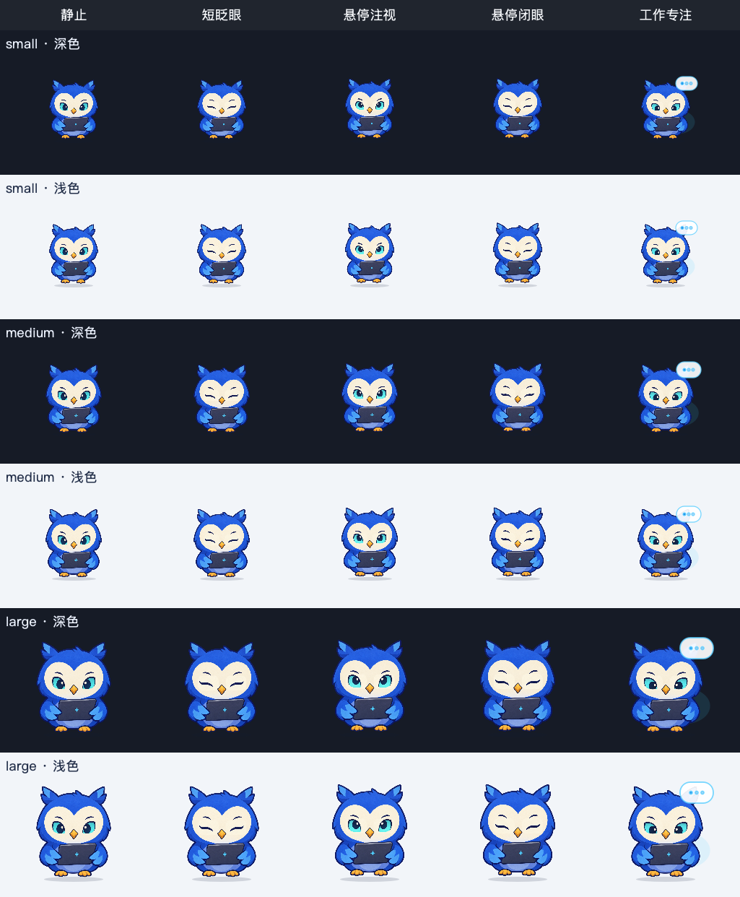

# 宠物动画调研与打磨

更新日期：2026-09-22。目标是借鉴 Codex 宠物的动画方法，不复制其角色造型。

## 可验证的 Codex 做法

- [官方宠物文档](https://learn.chatgpt.com/docs/pets)确认桌面宠物使用精灵动画，并在系统开启减少动态效果时改为静态帧；宠物状态与运行、需要输入、完成、受阻等任务状态相连。
- OpenAI 公开的 [hatch-pet 图集契约](https://github.com/openai/skills/blob/main/skills/.curated/hatch-pet/references/codex-pet-contract.md)描述透明 PNG/WebP、固定单元格和 CSS 背景位置播放。公开样例为 8 列 × 9 行、每格 192×208；这说明其制作流程以固定角色坐标和独立动作序列为基础，不说明桌面渲染器的全部实现。
- [动画行规范](https://github.com/openai/skills/blob/main/skills/.curated/hatch-pet/references/animation-rows.md)给待机、招手、跳跃、等待、工作等动作分配独立行，并为逐帧设置不同停留时间。待机示例为 280、110、110、140、140、320 毫秒，短变化和较长停顿交替。
- [官方制作与验收规范](https://github.com/openai/skills/blob/main/skills/.curated/hatch-pet/SKILL.md)要求低干扰待机、动作姿态与角色比例连续、透明背景干净，并在联系表和动图中拒绝体型跳变、残影、游离碎片及失去角色一致性的帧。

上述资料公开的是素材契约与制作方法；“自然感主要来自固定锚点、连续姿态、合理停顿和小尺寸可读性”是依据规范与当前样张作出的设计推断，不是对 Codex 私有渲染代码的断言。

## 本项目的实际问题

- 旧 `idle.png` 五帧的非透明轮廓在原图中逐帧向左偏移，首末帧中心差约 23 像素；旧 `hover.png` 部分帧头顶高度差约 13 像素。缩到默认 104×110 后仍能看到跳动。
- 原播放器把悬停帧各停留约 720 毫秒，角色体型和表情突变被放大；对同一角色的不同姿态做 alpha 交叉淡入还会产生双重轮廓。
- 当前高细节 3D 插画不适合让独立生成的整身图片直接连续播放。眼睛、羽毛、翅膀、电脑和爪子的细节过多，逐帧偏差很容易被看出来。

## 本轮修正

1. 待机精灵在加载时按角色中心和脚底对齐，再使用统一裁剪范围；眨眼改为短暂闭眼和回睁，中间保持长时间安静。
2. 旧悬停精灵经实际尺寸联系表验收有明显体型跳变，暂不播放。悬停改为同一张稳定角色图的一次轻微抬起、短眨眼与回位，持续约 1.4 秒，不左右晃动、不叠加残影。读取、生成、完成和失败状态保持原来的任务动作。
3. 减少动画模式继续显示静态帧；隐藏宠物后动画计时器继续停止。

## 2026-09-22 角色形象重设计与接入

根据用户允许重设计的要求，制作了独立的蓝色猫头鹰 v2：短三角耳羽、奶油色心形脸、青色眼睛、琥珀色喙与爪、深蓝笔记本电脑。整体改成清晰的二维插画轮廓，保留“桌面助理”识别点，同时避免沿用 Codex 蓝色机器人的造型。配套制作了只闭合眼睑的眨眼帧和同造型的应用图标；角色、聊天空状态、悬浮入口、菜单栏和 `.app` 图标保持一致。

主帧与闭眼帧使用相同的 1209×1301 透明画布和同一裁剪矩形。渲染前按 alpha ≥16 找到可见角色范围，忽略生成图中肉眼不可见的透明噪声；再等比缩放并以脚底为锚点放入 104×110 默认容器。这解决了先前边缘透明像素把主体缩得过小的问题，也避免了直接拉伸造成的角色变形。减少动态效果时始终显示睁眼静态图。

已用 104×110 实际尺寸检查深色、浅色底上的睁眼/闭眼/悬停渲染：角色轮廓和电脑可辨认，主体锚点偏差不超过 2 源像素，未见碎片、双重轮廓或残影。原 `idle.png` / `hover.png` 和旧宠物图仍留在源码用于历史对比，但不再参与应用播放或打包。

## 2026-09-22 节奏与交互第二轮打磨

用户确认 v2 形象更自然后，重点检查“动作何时发生”而不是增加整身帧数。原实现每 180 毫秒唤醒一次，以固定 96 步循环在两个固定位置眨眼，同时让身体持续作 0.35 像素的正弦浮动；长期放在桌面上会暴露机械重复。现在空闲时停止持续动画计时器，角色保持静止；独立单次计时器在 3.8–7.6 秒范围内安排短眨眼，闭眼约 115 毫秒后恢复，再选择下一次间隔。悬停时暂停待机眨眼，播放一次约 1.4 秒的轻抬与闭眼；移开时若动作尚未结束，用四步缓动回位，而不是突然跳回。任务状态动画、缩小模式和减少动态效果保持原有语义。

尝试过以主图为参考生成“注视鼠标”整帧表情，但羽毛与电脑也被轻微重画，整帧切换会增加闪动风险，因此当时没有接入。实际尺寸的待机、眨眼、悬停与离开序列如下：

素材制作使用内置 ImageGen。主图提示重点：原创、简洁的二维蓝色猫头鹰，稳定的耳羽/心形脸/青眼/喙/翅膀/笔记本比例，透明背景，无阴影和游离碎片；闭眼图以主图为引用，要求只改变眼睑，其余姿势和轮廓一致；图标以主图为引用，制作同角色正面头像与深蓝圆角方形底。最终源文件为 `ai_desktop/桌面宠物-v2.png`、`ai_desktop/pet_frames/blink-v2.png`、`ai_desktop/图标-v2.png`；`.icns` 由图标 PNG 转换为标准尺寸后打包。

## 2026-09-22 分层表情与工作停帧

为避免整帧重画带来的残影，新增 `ai_desktop/pet_layers/master.json`，明确固定画布、两块圆角眼部蒙版及表情素材路径。渲染前始终裁剪同一张主图，只把闭眼、悬停注视、工作专注素材的眼部区域覆盖到主图；头、羽毛、翅膀、笔记本和脚爪始终来自主图。素材源图仍为可替换的透明 PNG，蒙版坐标可在 JSON 调整；这不是完整的矢量或骨骼源文件。

动作序列现在为：待机保持静止，随机短眨眼后回睁；悬停时轻抬、注视、短眨眼、回到注视，移开后四步缓动回位；开始生成时短暂抬起并转为向下专注，六步后身体停稳，仅保留工作光效和状态徽标。减少动态效果时全部眼部切帧与位移停止，状态徽标仍显示。

在 92×97、104×110、140×147 三档大小及深浅背景制作实际控件渲染联系表。轮廓、电脑和脚爪跨表情保持一致，未见整身重影、侧边碎片或蒙版接缝；仍需真实桌面长时间观察节奏与 macOS 缩放表现。

本轮使用内置 ImageGen，生成并保存 `ai_desktop/pet_layers/attentive-v2.png`、`ai_desktop/pet_layers/focused-v2.png`。注视素材的核心提示为“以主图为准，保持 1209×1301 透明画布、造型、比例、羽毛、电脑、脚爪与位置，只让双眼视线轻微向上，保留睁眼与同一锚点”；专注素材的核心提示为“同一透明画布及所有身体细节，只让双眼视线轻微向下看笔记本，眼睑可略低，禁止新道具、背景与游离碎片”。生成图的非眼部差异不会进入运行时画面。

## 后续素材方案与验收

眼部可复用部件已完成。下一步若制作头部和翅膀动作，必须继续沿用同一主图与锚点。五组待机/五组悬停仍是素材库方向，不能为了凑数量回到独立整身图片轮播；先让现有静止、眨眼、注视、轻抬与工作专注在真实桌面验收通过。

每条序列须有透明联系表和按真实 104×110 尺寸播放的预览：脚底与主体中心偏差不超过 1 像素；没有翅膀碎片、双重轮廓、体型骤变或透明边缘杂色；首末帧能够自然闭环；悬停离开能立即恢复稳定姿态；减少动画、大小号与任务状态均不回退。通过视觉验收后再接入应用和冻结包。
