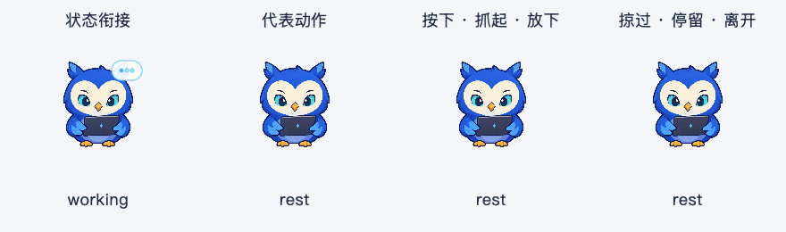
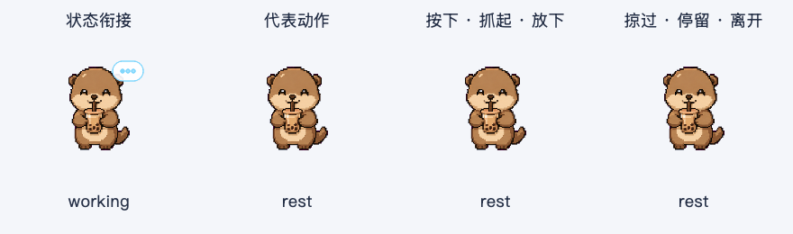

# 宠物独立部件跟随动作 · 2026-10-08

本轮让原有角色的附属部件稍晚于主体动作启动，轻微摆动后回到原位。使用现有图集中的部件像素，在运行时局部旋转；没有新增生成图片，也没有改变脸、身体、道具或脚。

2026-10-09 更新：[收尾验收](宠物收尾验收-2026-10-09.md)已修复后续复测确认的网络对象失效与线程清理卡死问题，最终源码的 1,583 项完整回归连续三轮通过，应用重新构建并完成隔离冒烟。本文保留 10 月 8 日的验证结果与当时限制，最终交付结果见收尾记录。

## 体验变化

| 形象 | 新动作 | 触发时机 | 收尾 |
| --- | --- | --- | --- |
| 内置猫头鹰 | 左右耳羽轻微错峰回弹 | 方向凝视、观察、代表动作、拖动放下 | 左右分别延迟 90 / 130 ms，完整部件动作最长 770 ms |
| Boba | 尾巴轻摆并逐渐减弱 | 举爪代表动作、拖动放下 | 延迟 180 ms，完整部件动作最长 1,060 ms |
| Astra、小新 | 保留上一轮的动作与节奏 | 原有触发规则 | 本轮未增加独立部件动作 |

采用衰减摆动曲线，角度按 0.5° 量化，保持短促、克制。配置上限分别为耳羽 6°、尾巴 10°，实际曲线峰值小于该上限。Boba 保留像素采样，猫头鹰保留平滑采样。

主体回到静止姿势后，耳羽或尾巴可以再完成一小段收尾。期间不会反复重新启动同一个部件动作；任务开始、按住、隐藏、紧凑模式和减少动态效果会清除部件动作。电脑休眠后的实际经过时间会让旧摆动过期，恢复后不会补播它。

Boba 的放下回应继续保持标称 540 ms，改为现有放爪补帧后安静停留，移除末尾会切换尾巴几何的旧眨眼帧。其他眨眼动作保留。

## 实现边界

- schema 1 新增可选 `secondary_motion`。旧配置默认静止；显式配置校验适用帧、部件范围、旋转中心、角度、延迟、触发强度、频率和像素预算。
- `pet_secondary.py` 提供有限时长播放器及局部合成器。仅提取声明的部件区域，固定身体覆盖部件根部，最终通过区域裁切保持其余像素不变。
- `pet_animator.py` 把部件时间与主体播放结合，任务和按住优先。播放器结束后不再安排部件唤醒。
- `spritesheet.py` 保存有限的姿势缓存，最多 24 项、约 200 万像素；加载新素材时清理缓存。当前猫头鹰上限为 19 项，Boba 为 24 项。
- `float_button.py` 的固定窗口遮罩包含部件旋转后的轮廓，避免摆动过程中切换点击区域或裁掉耳羽、尾巴。
- 猫头鹰图集编译器在相同网格下保留并校验已有行为配置，避免重新编译覆盖手工调整的节奏和部件标定。实际重编译后图集与配置指纹保持一致。
- 本轮没有改动原图集或 `~/.petdex` 素材；新增部件仅在已校准的帧上启用。Astra、小新未配置此功能。

## 验证记录

- [部件像素检查](assets/pet-secondary-audit-secondary-v5-2026-10-08.json)：猫头鹰 18 帧 × 5 个角度组合，Boba 5 帧 × 5 个角度组合，共 115 个姿势。部件范围外像素、脸部、道具和脚保持不变；零角度与原帧完全相同；参考帧各角度的连接检查通过。
- [动态采样](assets/pet-animation-audit-secondary-v5-2026-10-08.json)：四形象 × 四场景 × 90 帧，共 1,440 帧，裁切像素为 0。记录了实际出现的非零部件姿势；任务场景不播放部件摆动。
- [静态组合](assets/pet-experience-audit-secondary-v5-2026-10-08.json)：四形象 × 三种尺寸 × 两种背景 × 四种状态，共 96 个组合通过。
- [原生 Cocoa 检查](assets/pet-native-secondary-v5-2026-10-08.json)：四形象的工具条操作保留编辑器焦点和选区，朗读正确派发，原素材未修改。
- 新增回归覆盖延迟、有限时长、任务与按住打断、隐藏/紧凑/减少动态清理、休眠过期、旧配置兼容、部件所有权、缓存上限及非法元数据。
- [全量分组回归](assets/pet-secondary-v5-validation-2026-10-08.json)：74 个测试文件、1,576 项测试分为两个独立进程执行；宠物相关 332 项通过（29.35 秒），其余 1,244 项通过（39.22 秒），2 个原有收集警告。Ruff 与 `git diff --check` 通过。
- 验证限制：本次单进程整套 Qt 回归出现网络回复对象提前销毁、输入恢复测试超时及原生崩溃；网络相关 51 项独立通过，分组全量也通过。该不稳定问题尚未定位消除，本轮未修改网络传输生产逻辑，不能将分组结果表述为单进程整套通过。
- 安装包结果见下方完成记录。

## 复现与体验

```sh
python3 -m pytest tests/ -q
QT_QPA_PLATFORM=offscreen python3 scripts/audit_pet_secondary.py
QT_QPA_PLATFORM=offscreen python3 scripts/preview_pet_animation.py --feel --tag secondary-v5-2026-10-08
QT_QPA_PLATFORM=offscreen python3 scripts/preview_pet_experience.py --tag secondary-v5-2026-10-08
QT_QPA_PLATFORM=cocoa python3 scripts/preview_pet_experience.py --native-smoke --tag secondary-v5-2026-10-08
./scripts/build.sh --smoke
```

本次采用分组进程的全量回归方式：第一组为 `tests/test_pet_*.py`、`tests/test_float_button.py`、`tests/test_spritesheet.py`，第二组为 `tests/` 中其余测试文件。两组分别启动 pytest，覆盖全部 74 个测试文件。

退出旧应用，再打开 `dist/AI桌面助手.app`。先用内置猫头鹰停留并移动鼠标方向，观察左右耳羽稍晚启动；再用 Boba 拖动、放下，观察尾巴晚于身体轻摆并停住。在摆动过程中开始任务或开启减少动态效果，确认动作立即清除。

四列预览依次为任务衔接、代表动作、按下/拖动/松开，以及掠过/停留/离开。预览不启动模型、数据库、截图或全局快捷键；此次没有自动重启用户应用。





## 完成记录

- `dist/AI桌面助手.app` 已重建，版本 1.5.0，约 867 MB。稳定身份签名、严格校验与发布预检通过。
- 隔离冒烟通过：Apple Vision OCR、英语朗读、搜索 Keychain 桥接、Bash 运行时、Fluent 命令/搜索卡、任务授权卡、审计历史与 schema 5 首次启动。
- schema 0 升级、14 项持久化设置与备份验证通过。
- [包内一致性](assets/pet-secondary-v5-bundle-2026-10-08.json)：9 个运行模块匹配当前源码，7 项图片/配置的 SHA-256 一致；Astra、Boba 补帧正常加载。猫头鹰耳羽与 Boba 尾巴配置可从包内加载，生成非零旋转姿势，并按有限时长结束。
- 三张图集/补帧图片的指纹与上一轮构建一致；本轮新增动作没有修改这些图片。
- 完整分组回归与单进程 Qt 回归限制见上方验证记录；没有自动重启用户应用，也没有提交或推送代码。
