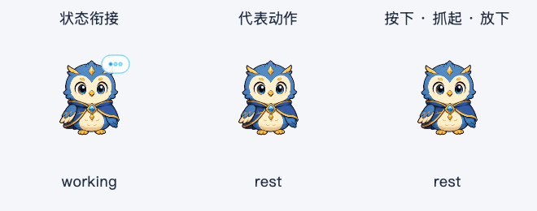
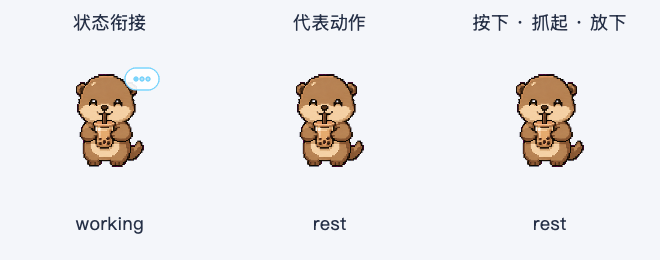
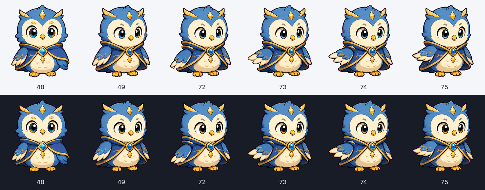
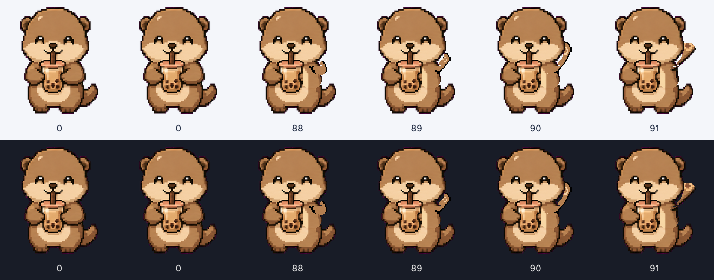

# 宠物连续动作补帧 · 2026-10-07–08

承接上一轮的动作调度与状态衔接，本轮补齐 Astra 展翼、Boba 举爪的实际肢体中间帧。四个形象继续保留；内置猫头鹰和小新沿用上一轮素材与动作。

## 体验变化

| 形象 | 动作 | 本轮补帧 | 完整动作时长 |
| --- | --- | --- | --- |
| Astra | 侧看 → 小幅展翼 → 停留 → 收翼 → 回正 | 3 个新绘中间姿势，以及 1 个保持身体对齐的原有展翼终点 | 1,050 ms |
| Boba | 举爪 → 停留 → 放下 | 3 个新绘中间姿势，以及 1 个保持身体对齐的原有举爪终点 | 950 ms |

两者的代表动作与悬停招呼共享补帧；Boba 拖动时使用中段举爪姿势，松开时逐步放下。动作仍偶尔出现，保留上一轮的类别冷却与闲置停留。

补帧动作中开始任务，可以从正在显示的新增姿势收回并进入专注状态。Astra 收翼到专注最长 390 ms，Boba 放下到专注最长 355 ms。任务标签即时更新，过渡可以再次被打断。“减少动态效果”仍直接显示语义姿势。

本轮仅补齐这两个局部动作，尚未扩展全身骨骼、走跑、耳尾延迟或更多姿势库。

## 素材与身份保持

通过内置 `image_gen` 编辑工具生成候选中间帧，再用确定性编译脚本注册到原图集坐标；应用只使用局部翅膀或手臂区域，身体其他部分继续取原帧。Astra 第一版展翼过大，已弃用，第二版修正为原终点范围内的小幅动作。

- Astra 保留原头、脚、翅膀区域外的身体像素。
- Boba 保留原头、茶杯、脚与手臂区域外的身体像素。抬爪后露出的身体使用原终点姿势的身体片段，避免透明缺口。
- Boba 的新绘手臂使用最近邻采样、原图主要色板和清晰透明边缘，保护原有脸部的边缘像素。
- 原 `~/.petdex` 图集与配置保持不变；仅原图 SHA-256 和网格完全匹配时应用这些动作。
- 全部生成提示词、参考帧、候选取舍见 [生成记录](assets/pet-motion-source/generation-v1.json)，局部范围和注册参数见 [校准记录](assets/pet-motion-source/calibration-v1.json)。

最终运行素材：

- [Astra 局部图集](../ai_desktop/pets/petdex-profiles/motion/astra-limb-v1.png)，576 × 208，3 格；终点取原图第 52 帧的翅膀区域。
- [Boba 局部图集](../ai_desktop/pets/petdex-profiles/motion/boba-limb-v1.png)，768 × 208，4 格；含 3 个中间帧与注册后的原终点。

## 加载与回退

`pet_manifest.py` 为 schema 1 增加可选 `frame_patches`，原图集帧数继续参与指纹匹配，追加帧单独计数。Astra 总帧数由 72 变为 76，Boba 由 88 变为 92。

`spritesheet.py` 在加载时一次性追加局部合成帧，播放时直接取帧。合成使用透明画布和 Source 覆盖，能擦除原肢体，避免旧手臂残影。重复加载不会重复追加。

补帧图片缺失、损坏、尺寸不符或 SHA-256 不符时，新增帧回退到原姿势，宠物仍可显示。原图终点可以继续规范化合成。配置解析约束局部路径、符号链接范围、帧索引、多边形、有限坐标与图片预算。

打包配置和发布检查同步加入两张局部图集；发布检查会拒绝缺失这些素材的安装包。

## 验证与复现

```sh
QT_QPA_PLATFORM=offscreen python3 scripts/compile_pet_motion.py
QT_QPA_PLATFORM=offscreen python3 scripts/audit_pet_motion.py
QT_QPA_PLATFORM=offscreen python3 scripts/preview_pet_animation.py --tag motion-v3-2026-10-07
QT_QPA_PLATFORM=offscreen python3 scripts/preview_pet_experience.py --tag motion-v3-2026-10-07
QT_QPA_PLATFORM=cocoa python3 scripts/preview_pet_experience.py --native-smoke --tag motion-v3-2026-10-07
python3 -m pytest tests/ -q
```

编译与原素材审计需要本机现有的匹配 Petdex 图集；应用运行时只需要已编译好的局部图集。

- 新增补帧测试 24 项通过，覆盖局部像素不变、透明擦除、异常素材回退、重新加载、配置校验，以及每个新增姿势被任务打断。
- 相关发布检查 7 项通过，包含补帧资源缺失检查。
- 全量回归：1,473 项通过，2 个原有收集警告；标准命令耗时 56.82 秒。测试初始化在首次绘制前执行一次对象回收，规避本机全量收集后首次 SVG 绘制中的 Qt 崩溃；此处理仅在测试中生效。单独动作面板 10 项、其余 1,463 项，以及收集后回收对象的独立诊断运行均通过。
- [逐像素审计](assets/pet-motion-v3-audit-2026-10-07.json)通过：两只宠物全部 8 个新增姿势的头、脚和局部范围外像素保持一致，Boba 茶杯像素保持一致。
- [动画采样](assets/pet-animation-audit-motion-v3-2026-10-07.json)：四形象 × 三段 × 90 帧，共 1,080 帧，无绘制像素越出遮罩；两组新素材实际加载成功。
- [静态组合](assets/pet-experience-audit-motion-v3-2026-10-07.json)：四形象 × 三尺寸 × 两背景 × 四状态，共 96 个组合通过。
- [原生 Cocoa](assets/pet-native-motion-v3-2026-10-07.json)：四形象工具条操作保留编辑器焦点和选区，朗读正确派发。
- [打包一致性](assets/pet-motion-v3-bundle-2026-10-07.json)：8 个运行模块、7 项配置和图片资源匹配当前源码；从安装包配置实际加载两组补帧成功。
- `dist/AI桌面助手.app` 已重建，版本 1.5.0，约 867 MB，稳定签名与 release preflight 通过。
- 打包后的 OCR、英语朗读、搜索桥接、Bash、Fluent 任务卡、schema 5 初始化及 schema 0 升级隔离冒烟通过。
- Ruff 与 `git diff --check` 通过。

## 动态预览

三列依次是任务状态衔接、代表动作、按下/拖动/松开，使用真实 Qt 窗口与播放器每 50 ms 采样。





原生姿势对照：





## 体验方式

退出旧应用后，打开本次 `dist/AI桌面助手.app`。先切到 Astra 和 Boba，观察悬停招呼与拖动放下；动作中开始一项任务，检查收翼、放爪到专注姿势的衔接。最后分别用浅色、深色背景与“减少动态效果”体验。

本轮没有重启用户正在使用的应用。
