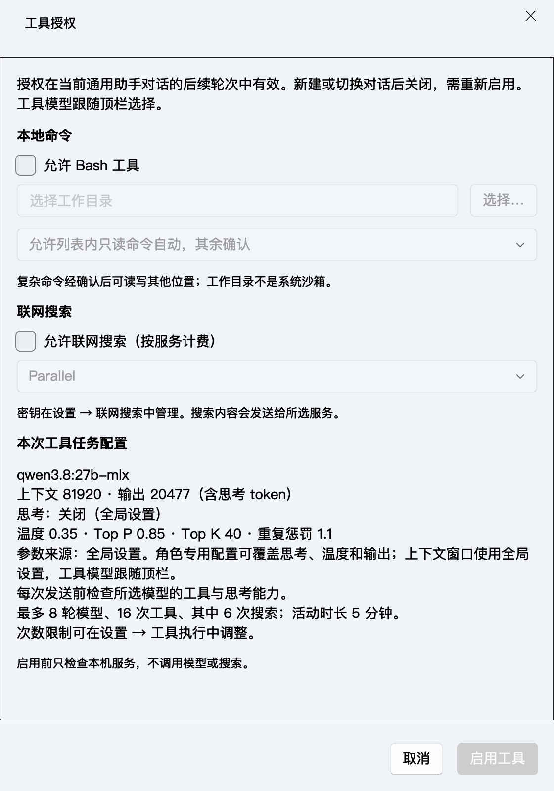

# 工具模型参数一致性修复

日期：2026-10-05，候选版本 1.5.0。本次修复表现层与实际模型请求的配置分离问题，没有扩大 Agent 授权范围。

## 问题与原因

设置页使用用户持久化参数；工具授权窗口和 worker_kwargs 则使用早期 H0 夹具中的 8192 上下文、1024 输出、temperature=0，并优先关闭思考。此前只修复了固定模型，未同步参数来源。因此截图中的 81920 设置没有应用到工具请求，Top P / Top K / 重复惩罚也被独立参数覆盖。

## 当前规则

| 参数 | 工具任务实际来源 |
|---|---|
| 模型 | 顶栏当前选择；不会由角色配置换成另一模型 |
| 上下文、Top P、Top K、重复惩罚 | 设置中的全局值 |
| 输出、温度 | 角色专用配置覆盖全局值；未覆盖时继承全局 |
| 思考 | 角色或全局的请求选项，按本次所选模型的能力声明重新解析 |
| 工具/搜索次数、模型轮次 | 工具执行页；与生成参数分开 |

全局选项现在由共享函数读取。授权预览、能力检查、请求创建和重新执行共享 TaskModelSettings 不可变快照；审计同时记录实际 options、请求的思考模式、参数来源及能力回退说明。一个运行内各模型步骤沿用同一配置。

- 截图中的上下文 81920 会在工具面板和实际请求中均为 81920，不再暗中改成 8192。
- 支持的思考开关或命名档位原样使用；缺少或不支持的声明回退为模型默认，并在发送时提示，不强制关闭或开启。
- 修改生成设置或角色配置时，取消尚未结束的模型检查并恢复草稿，工具授权保留。下次发送重新校验新值，运行中的快照不被修改。
- 模型声明的上下文上限小于请求值时明确拒绝；输出上限加 512 token 保留空间必须小于上下文窗口，实际输入能否容纳仍由生产循环检查。不会静默改小参数。普通聊天沿用既有规则。
- H0 参数常量只保留作历史证据匹配，不用于产品请求。新设置不自动继承旧预算验证结论。

## 验证

新增 17 项回归，全量 **1113 passed**，2 条既有收集警告。覆盖真实 QtNetwork 模拟 HTTP 的两轮工具请求、角色覆盖与顶栏 27B、思考精确档位/回退、模型上下文不足、输出预算冲突、重新执行/追问、新旧检查取消与草稿保留、请求及审计一致性，以及打包自检不改变全局参数。相关 83 项回归通过，Ruff 和差异检查通过。

[源码原生窗口专项](harness-h6/task-model-settings-source-2026-10-05.json)已通过：隔离保存/重载 81920、20477 和完整六项配置，核对工具预览、不可变 Worker 请求与发现记录。该专项使用合成能力声明，不运行 81920 窗口的真实推理，不执行工具、不读取密钥，不修改用户设置。

首次包内合成自检继承默认 8192/20480 后触发预算拒绝，已改为自检自己的 8192/512 夹具，并新增隔离回归；见 [初次自检失败记录](harness-h6/task-model-settings-initial-smoke-failure-2026-10-05.json)。这不改变用户生成设置。最终 [冻结 App 参数专项](harness-h6/task-model-settings-packaged-2026-10-05.json)通过：原生 Cocoa Qt、顶栏 27B，保存/重载 81920 上下文、20477 输出与完整六项参数，授权预览、Worker 请求和发现记录一致。仍为合成能力声明和未启动的请求快照，未运行真实 81920 窗口推理。

[冻结 App 真实 Bash 闭环](harness-h6/task-model-settings-bash-packaged-2026-10-05.json)通过：本地 9B 使用独立验收配置 8192/512，完成临时文件读取与两轮回答，运行记录与当前六项全局参数一致，约 6.6 秒。它验证取消固定 1024 输出后的生产流程，不代表 27B 大窗口性能测试。两项均使用临时数据，不读取用户文件或密钥，不调用付费搜索。

`dist/AI桌面助手.app` 1.5.0 已重建，约 867MB，沿用稳定证书；严格签名、发布预检、包内隔离冒烟、schema 5 启动/schema 0 升级备份通过。41 个相关冻结模块与最终源码一致，15 份当前文档链接有效。退出旧 App 后打开该候选即可使用；配置无须重新填写。

本轮未 commit / push，未更新 DMG、标签或 Release；已有测试隔离改动与未跟踪发布脚本保留。
