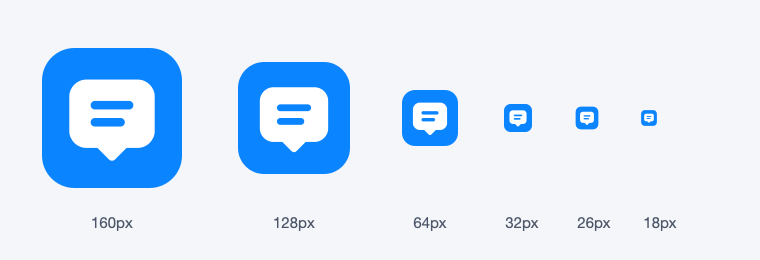

# 应用图标来源与适配

日期：2026-10-03。用户要求使用现成图标，并明确应用图标独立于可选的宠物形象，不使用猫头鹰。

## 选用素材

采用 [Tabler Icons 官方仓库](https://github.com/tabler/tabler-icons) 的现成 `message-2` 填充对话气泡图标。图形中没有动物、人物或其他产品的品牌标记；上游 SVG 路径保持原样，只将颜色调整为白色，适配蓝色 macOS 圆角应用底板与多尺寸输出。

- [固定版本 SVG 来源](https://github.com/tabler/tabler-icons/blob/e54656d27e9682d61482626bf9f4d093928b7c95/icons/filled/message-2.svg)
- 本地原始素材：[message-2.svg](../ai_desktop/assets/tabler/message-2.svg)
- 上游作者：Paweł Kuna / Tabler Icons contributors。
- 许可：MIT，原始版权和许可全文保留在 [LICENSE](../ai_desktop/assets/tabler/LICENSE)，并随应用包和 Python 包分发。
- 原始 SVG SHA-256：`05e6ad0d6a313f47268e20dd7bdc540794254db7798bdb03f02edd9122d47f78`。

没有生成新的宠物/吉祥物图形，没有复制竞品产品标志。

## 集成与复现

继续使用现有 `图标-v2.png` / `图标-v2.icns` 资源入口，因此 Dock/Finder、聊天标题栏、菜单栏和紧凑悬浮入口都指向新图标；原有桌宠素材与可选角色不变。

```sh
QT_QPA_PLATFORM=offscreen python3 scripts/generate_app_icon.py
./scripts/build.sh --smoke
```

生成脚本通过 Qt SVG 渲染原始路径，输出 1024px PNG 和标准 16/32/128/256/512px 及对应 Retina 的 macOS ICNS。使用系统 `iconutil` 转换；当前受限环境需要允许访问系统图像服务才能转换，正常 macOS 本地终端无需额外配置。



## 验证

图标已检查透明边角、多个尺寸和小尺寸可读性。菜单栏、悬浮按钮、聊天与发布检查定向回归 **126 passed**；新版 `.app` 稳定签名、发布预检和隔离冒烟通过，Dock ICNS 与包内 PNG/原始素材/许可已核对一致。最终包验证记录见 [开发进度](开发进度.md)。应用包必须携带原始 SVG、MIT 许可证和来源说明，发布预检已加入这三项资源检查。
