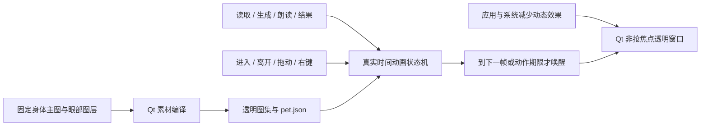
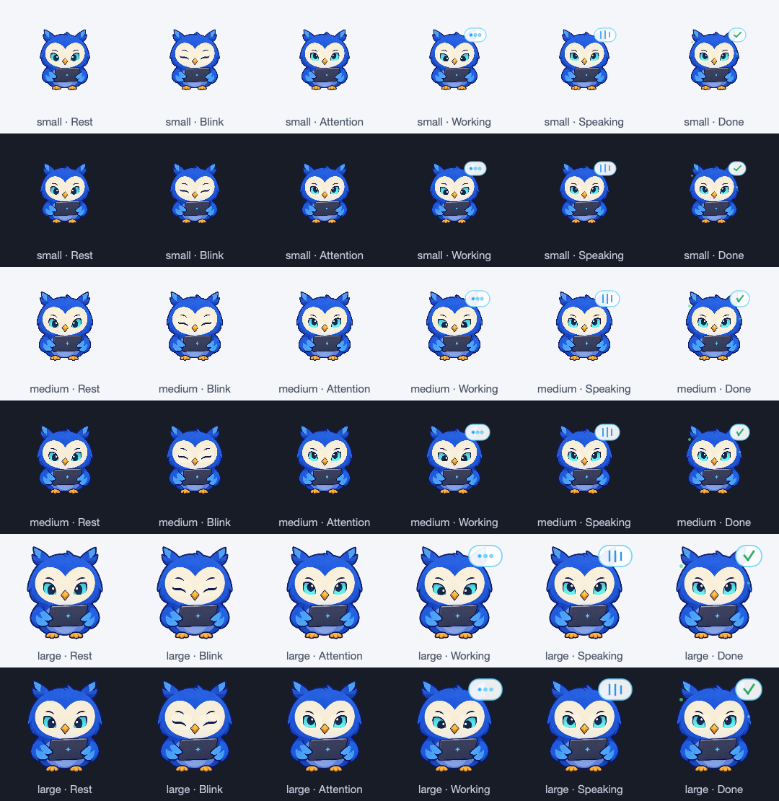
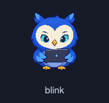
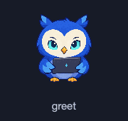

# 虚拟宠物技术对标与打磨

日期：2026-10-03。目标：保留原创蓝色猫头鹰的识别度，以 Codex、Qoder 的成熟桌面体验为对标，改善自然感、状态一致性、功耗和素材生产流程。本文覆盖当前工作区尚未提交的精灵引擎改动，并在其基础上继续完善。观感是否达到或超过竞品，需要真实桌面对比；自动化通过不等于已证明超越。

## 调研证据与边界

| 产品 | 已公开、可核实 | 未公开，不能当作事实 | 本项目采用的做法 |
|---|---|---|---|
| Codex / OpenAI 桌面宠物 | OpenAI 公开图集契约：PNG/WebP、透明底、8×9 网格、192×208 单元；契约说明 webview 用 CSS 背景位置播放。动作行使用逐帧时间，不是全部等时。 | 私有桌面窗口代码、完整调度策略、真实帧率与 CPU/GPU 占用 | 固定单元、同一身体和脚底坐标、逐帧时长、静止停顿、独立语义状态 |
| OpenAI 当前桌面宠物文档 | 悬浮入口、拖动/缩放/隐藏、状态提示、系统减少动态效果时显示静态帧。现行文档已以 ChatGPT 桌面为主要入口，同时说明 Codex CLI 与 IDE 的差别。 | 不应把当前文档所有功能倒推成用户截图所在旧版本的实现 | 保留非抢焦点窗口、持久化放置、状态徽标和系统偏好响应 |
| Qoder Qoduck | 主窗口之外常驻，设置即时显示/隐藏与调整尺寸，可拖动；Live Voice 中可临时作为语音入口，关闭主应用后消失 | 没有公开其精灵图、Lottie、骨骼、WebGL 或原生渲染的实现，不能确定它用哪一种 | 操作即时生效、入口与应用任务绑定、用户可控制干扰程度；沿用已有朗读入口 |

| eSheep（开源桌宠） | 作者仓库公开透明动作图集与 XML 动画定义，支持桌面窗口检测与多屏移动 | 不可据此推断 Codex / Qoder 的实现 | 借鉴素材与动作定义分离；本助手继续保持安静固定位置，不引入随机桌面漫游 |

来源均为第一方：

- [OpenAI 图集契约](https://github.com/openai/skills/blob/main/skills/.curated/hatch-pet/references/codex-pet-contract.md)。公开制作协议，不是完整客户端源码。
- [OpenAI 动画行与时长](https://github.com/openai/skills/blob/main/skills/.curated/hatch-pet/references/animation-rows.md)。例如待机动作有较短变化和较长首尾停顿；工作动作与跑步动作分开。
- [OpenAI 宠物产品文档](https://learn.chatgpt.com/docs/pets)。描述桌面行为和减少动态效果。
- [Qoder Desktop Pet](https://docs.qoder.com/qoder/desktop-pet)。公开产品行为，未披露动画技术栈。
- [eSheep 作者仓库](https://github.com/Adrianotiger/desktopPet)。用于核对成熟开源桌宠的图集与数据配置思路；未复制其代码或素材。
- [Apple 系统减少动态效果 API](https://developer.apple.com/documentation/appkit/nsworkspace/accessibilitydisplayshouldreducemotion?language=objc)及[变化通知](https://developer.apple.com/documentation/appkit/nsworkspace/accessibilitydisplayoptionsdidchangenotification)。本项目通过 NSWorkspace 通知桥接 Qt，避免轮询。

设计推断：自然感主要来自角色姿态连续、动作幅度克制、时间停顿合理以及鼠标操作与状态响应一致。单纯增加图片数量或刷新频率，无法修复整身重画和坐标跳变。

## 本轮发现的问题

1. 新增的 `generate_spritesheet.py` 以整身横向平移表达看左右，以缩小全身表达眨眼；这些方式会让角色滑动、体型突变，和此前用户不喜欢的待机晃动相冲突。
2. 生成脚本多次 `paste(..., mask=自身 alpha)`，会再次乘入透明度，软边缘容易变薄。固定画布又按原图留白缩放，角色在真实窗口中偏小。
3. 原播放器只支持等时 FPS，丢弃第一次 tick 的时间，动画切换还会重置时间余量。随机动作测试使用“如果触发才断言”，无法保证验证到待机动作。
4. 源码同时保留旧眨眼计时器和新精灵播放器。旧逻辑在待机时停止播放器，使新待机序列无法执行；悬停也没有语义动作接入。
5. 同一状态重复同步会重置播放进度；成功/失败使用同一庆祝序列；低优先级结果可能插到工作中。
6. `.spec` 缺少 `pet.json` 和新图集，打包与源码行为可能不一致。
7. 外部图集帧索引、逐帧时间、非法 FPS 和路径缺少完整校验；坏素材没有明确降级路径。

## 已实现的技术方案



### 素材与表现

- 保留已有二维猫头鹰、笔记本和主图，不复制 Codex 机器人或 Qoder 小鸭。没有新增独立生成的整身帧。
- 通过已有眼部蒙版，将睁眼、闭眼、注视和专注表情覆盖到同一身体。身体、耳羽、翅膀、电脑和爪子的像素保持一致，消除整身跳变。
- 图集使用 312×330 固定单元、8 列、11 个可复用姿势；默认窗口 104×110，提供约三倍逻辑分辨率的素材，继续保留小/中/大尺寸。
- 空闲基础姿势完全静止，没有左右摆动或持续上下浮动。五组待机和五组悬停是同一组可靠姿势组合出的节奏变化，不是十组重新生成的身体图片。
- 单次点头只移动最多 3 源像素，默认尺寸约 1 像素，垂直进退，首尾回到稳定姿势。错误用短闭眼停顿，与成功点头区分。
- 绘制时先清空透明背板，再绘制一个当前帧；不做整身交叉淡入，不同时叠画新旧姿势。

| 场景 | 动作 | 节奏 / 终态 |
|---|---|---|
| 待机 1 | 短眨眼 | 短闭眼后回睁 |
| 待机 2 | 双眨眼 | 两次眨眼之间保留停顿 |
| 待机 3 | 慢眨眼 | 稍长闭眼与回睁 |
| 待机 4 | 抬眼观察 | 注视约 620ms 后归位 |
| 待机 5 | 眼神休息 | 短暂低眼后归位 |
| 悬停 1 | 招呼 | 注视、短眨眼、回到注视 |
| 悬停 2 | 轻点头 | 固定横坐标，轻微垂直点头 |
| 悬停 3 | 好奇注视 | 注视、低眼、再注视 |
| 悬停 4 | 友好慢眨眼 | 较长闭眼后注视 |
| 悬停 5 | 双眨眼回应 | 两次短眨眼后注视 |

待机动作间隔随机为 4.8–9.6 秒，连续选择避免相同动作；悬停每次进入只回应一次，随后静止。快速进出有 800ms 冷却，避免边缘来回穿越造成连续招呼。鼠标离开时完成当前短动作后归位；任务开始立即抢占。长时间工作不让全身持续跳动，保持专注眼神及原有任务徽标。

### 调度与交互

- `pet_manifest.py` 增加 `durations_ms` 和悬停 `reactions`，兼容原来的 FPS；保留小数 FPS，拒绝 NaN/Infinity、越界帧、错误时长、循环的一次性动作与越出目录的资源路径，并限制图集预算。
- `pet_animator.py` 明确基础、环境、悬停回应、结果四类序列；重复状态通知不重启动作，真实任务抢占低优先级动作，结果通知合并避免排队。
- `FloatButton` 使用单调时钟推进，按下一个有效帧/待机期限安排单次计时器；长静止不刷新，长时间系统暂停不快速重放积压动作。删除旧的全身悬停相位与独立眨眼逻辑。
- 所有姿势共享轮廓命中区域，透明角落继续穿透，轻点头不会因窗口 mask 不同而触发进入/离开抖动。拖动和右键菜单暂停动作，结束后重置时间基准。
- 原有单击开合、拖动阈值、手动固定屏幕、右键朗读/截图/快捷动作、隐藏后菜单栏恢复均保留。
- 应用减少动画偏好与系统偏好取逻辑 OR。系统偏好改变通过通知即时生效；停止位移、切帧与光效，仍保留语义姿势及状态徽标。
- 损坏或不兼容的自定义图集回退到内置猫头鹰并记录原因。源码资源、Python wheel 和 `.app` 使用同一图集；发布预检要求包内存在 manifest 和图集。

当前 `petdex` 入口仅支持本项目 schema 1 的 `pet.json`；不是对任意第三方宠物包、Codex 原始 manifest 的兼容承诺。

## 验证与复现

- 定向回归覆盖非等时播放、静态待机唤醒、动作回位、不重复选择、任务抢占、重复通知、减少动态效果、外部包回退、所有帧命中区域，以及眼部变化不能重画身体。
- 全量测试 **600 passed**；最后快速重新悬停边界修正经 **97 项**宠物/打包定向回归，ruff 与差异检查通过。两条 `TestWidget/TestDialog` 收集警告为既有问题。
- 最终 `1.5.0` `.app` 约 869MB；稳定签名、严格校验、发布预检、OCR/英文语音与数据库启动/升级冒烟通过。已核对包内代码与最终源码、manifest/图集哈希一致。
- 原生 Cocoa 冒烟：猫头鹰成功加载、系统减少动画 observer 成功注册，独立窗口自动退出，不改用户系统设置。
- 独立宠物离屏 20.09 秒观察：16 次动作帧唤醒、2 次待机唤醒，平均 CPU 0.031%，进程峰值 RSS 65.98MiB。仅作本轮独立控件测量，不代表完整应用、GPU 或长期真实桌面功耗。
- 真实 Qt 控件在三档尺寸及深浅背景生成预览，逐帧验证角色/body 像素和稳定命中区域。GIF 为动作库节奏预览，展示间隔缩短到 1.6 秒，运行时待机仍为 4.8–9.6 秒。

```sh
QT_QPA_PLATFORM=offscreen python3 -m ai_desktop.pets.owl-v2.generate_spritesheet
QT_QPA_PLATFORM=offscreen python3 scripts/preview_pet.py
QT_QPA_PLATFORM=offscreen python3 -m pytest tests/test_pet_animator.py tests/test_pet_manifest.py tests/test_spritesheet.py tests/test_float_button.py -q
./scripts/build.sh --smoke
```







## 下一步质量门槛

本轮完成动画与素材基础的修正。若要继续接近并争取超过竞品，下一轮重点应是更有角色表现力的部件动作和更直接的鼠标入口，而不是继续堆整身帧：

1. 先在最新构建观察 10–20 分钟：边缘残影、眨眼节奏、悬停进出、拖动后松手、朗读中/生成中鼠标进入、系统减少动画切换。多屏 Retina / Spaces 仍须人工观察。
2. 增加可维护的头部、眼睑、瞳孔、翅膀独立源部件，统一脚底坐标；制作真实半闭眼和小幅头部朝向，优先改善眼神衔接。现有素材是 PNG 与蒙版，不能把它描述为已具备完整骨骼模型。
3. 评估悬停操作胶囊：对话、截图、朗读选区最多三个入口；有清晰标签且不抢当前应用焦点。先验证误触率与选区保留，再代替部分右键菜单路径。
4. 只在应用已有对应事件时增加等待用户/取消/重试姿势；不引入与实际任务无关的随机跑步、频繁跳跃和虚构状态。
5. 建立同屏真实尺寸录像对比，以轮廓稳定、连续姿态、操作延迟、干扰程度、长期功耗和用户偏好评分验收。当前没有 Codex/Qoder 的同期性能或用户对比测量，不宣称“已超越”。

## Petdex：Astra、Boba、Shinchan 的本轮适配

此前三只外部宠物只共享引擎改进，并未逐一检查素材与动作。逐帧审查确认，它们的原始 `pet.json` 复制了相同通用配置，但图集按动作行排列；例如工作使用 `[6,7,8,7]`，其中第 7 帧为空，第 8 帧已是跑步。朗读使用 `[9,10,9,10]`，同样误入跑步行。这个问题不能用调快刷新率解决。

本轮新增 `ai_desktop/pets/petdex-profiles/`，按已检查图集的 SHA-256、单元尺寸、列数、帧数匹配后自动应用。保留 `~/.petdex/pets` 的原始文件；陌生宠物或同名重新生成的图集沿用自己的 manifest，不套用旧索引。配置丢失/损坏也不会阻止合法原始宠物加载。原图仍须存在；应用包只携带适配配置。

| 角色 | 基础 / 工作姿势 | 五组待机节奏 | 五组悬停回应 | 画风处理 |
|---|---|---|---|---|
| Astra | 48 / 65 | 短眨眼、双眨眼、慢眨眼、侧眼观察、小幅歪头 | 轻展羽翼、友好眨眼、好奇歪头、安静注视、双眨眼 | 平滑采样、保留蓝金配色 |
| Boba | 0 / 65 | 三种眨眼节奏、短喝一口、奶茶小憩 | 小爪招呼、友好眨眼、喝茶回应、短停顿、双眨眼 | 像素采样、保留毛发与奶茶细节 |
| Shinchan | 48 / 64 | 三种眨眼节奏、轻张嘴、向前观察 | 举手招呼、友好眨眼、轻张嘴回应、安静注视、双眨眼 | 像素采样、保留线条与红黄配色 |

这些动作是可靠现有姿势的节奏组合，未宣称新增十套独立原画。三只角色长时间待机和工作均以静止姿势为主；Astra、Boba 朗读时用稳定姿势与语音状态徽标，Shinchan 只偶尔短张嘴，不宣称逐音素口型同步。成功/错误用短表情，不自动奔跑、跳跃、哭泣趴倒。五组动作首尾返回同一基础帧，单次最长 1.32 秒；实际待机间隔仍为 4.8–9.6 秒，悬停保持一次进入一次回应。

三只图集含品红背景去除后的轮廓底色污染。加载时仅对已匹配的三只角色启用颜色溢出修正，将高品红像素中的底色分量减去，透明度不变；蓝羽、红衣与棕毛不在目标色域内。原图不重写。每只角色用同一缩放与脚底基线，不为每帧重新裁切/自动居中。所选姿势的可见底边都在源图第 202 行；命中区域仅合并配置实际用到的姿势，透明桌面角落继续可点击。

### 预览与复现

在应用设置的“桌面宠物”中选择原有 `astra / boba / shinchan (Petdex)` 即自动使用本轮适配，无须重新导入。

```sh
QT_QPA_PLATFORM=offscreen python3 scripts/preview_petdex.py
QT_QPA_PLATFORM=offscreen python3 -m pytest tests/test_pet_profiles.py tests/test_spritesheet.py tests/test_float_button.py -q
```

预览脚本直接加载本地原始图集、项目适配配置与实际 `FloatButton`，生成三档尺寸×深浅背景，以及每只角色的待机/悬停 GIF。GIF 展示间隔缩短到 1.6 秒便于审阅；运行时并不会这样频繁播放。帧索引、图集哈希和轮廓审查结果保存在 [Petdex 审查记录](assets/petdex-audit-2026-10-03.json)。

| 角色 | 尺寸与背景 | 待机节奏 | 悬停回应 |
|---|---|---|---|
| Astra | [静态预览](assets/petdex-astra-2026-10-03.png) | [待机 GIF](assets/petdex-astra-idle-2026-10-03.gif) | [悬停 GIF](assets/petdex-astra-hover-2026-10-03.gif) |
| Boba | [静态预览](assets/petdex-boba-2026-10-03.png) | [待机 GIF](assets/petdex-boba-idle-2026-10-03.gif) | [悬停 GIF](assets/petdex-boba-hover-2026-10-03.gif) |
| Shinchan | [静态预览](assets/petdex-shinchan-2026-10-03.png) | [待机 GIF](assets/petdex-shinchan-idle-2026-10-03.gif) | [悬停 GIF](assets/petdex-shinchan-hover-2026-10-03.gif) |

验证覆盖精确匹配、同名素材变化、网格变化、配置损坏/丢失、原文件不变、动作用帧合法、首尾回位、悬停收尾、任务抢占、停止动态效果及品红修正保护透明度和角色配色。当前全量 616 项通过，另见开发进度中的最终包检查。已检查的所有选中帧非空、三档尺寸无轮廓裁切。

素材层仍存在不同动作行的局部绘制差异，尤其 Shinchan 举手时的脸型；本轮优先用连续姿势和短回应限制突变，尚不是可独立控制眼睑/瞳孔/手臂的分层源工程。最终是否达到 Codex / Qoder 的观感，需要真实桌面比较。下一阶段如这些短回应仍显跳变，按同一固定角色基准重绘半闭眼、手臂中间姿势，先完成一组连续动作再扩展，避免重新独立生成整身造成身份漂移。

### 用户反馈修正：移除背景圆和脚底椭圆

2026-10-03 后续体验截图显示，工作/朗读的浅蓝光晕和额外脚底椭圆在网页文字上显得突兀。这两层由 Qt 控件绘制，并非宠物素材自带。本轮已统一去掉；右上角任务气泡继续表达生成、朗读与结果状态。脚底投影的额外命中区域也已删除。本文上述预览已重新生成，当前基线不再绘制这两层装饰，旧记录中的光效/投影描述为历史实现。
